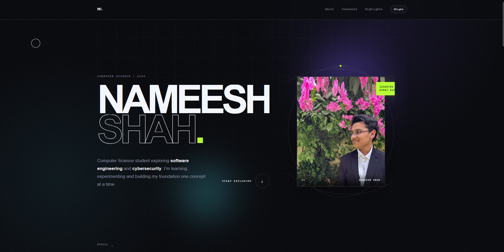
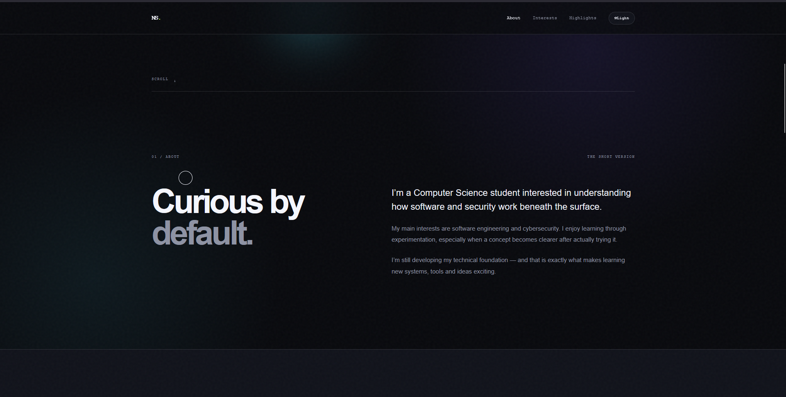
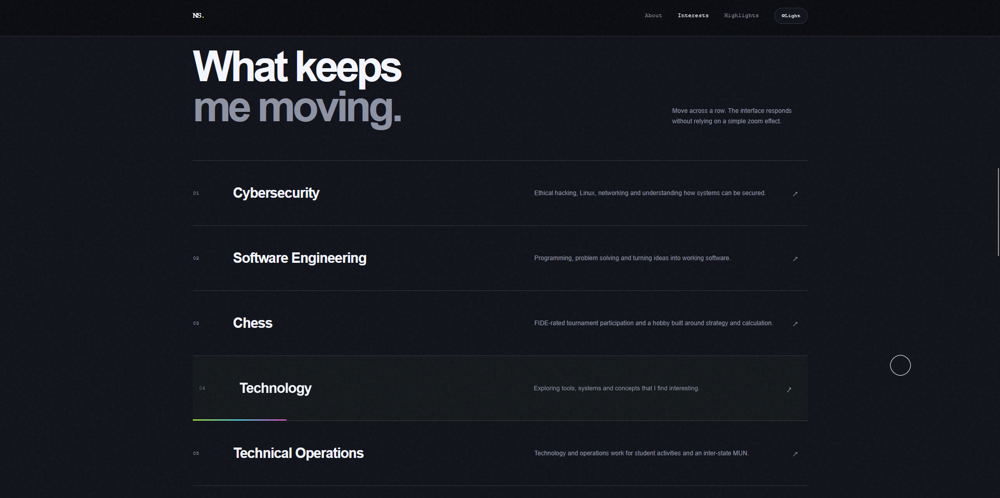
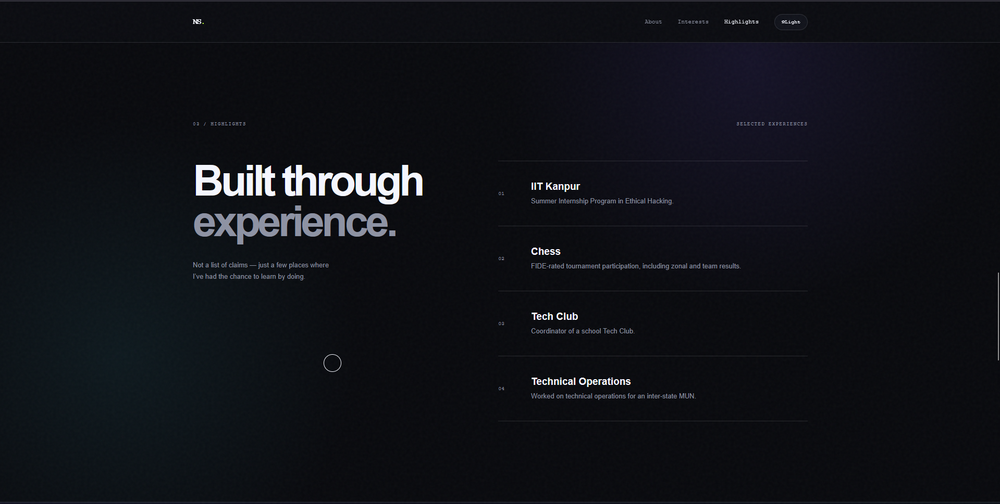
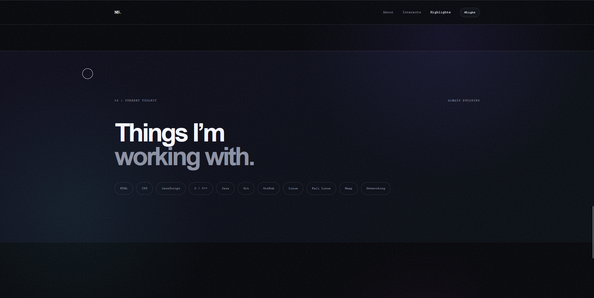
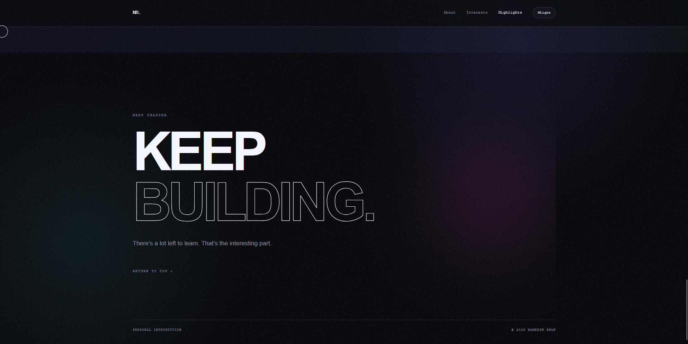

````markdown
# NSCC Task 2 — Personal Introduction

> A responsive, interactive personal introduction website built from HTML5, CSS3 and Vanilla JavaScript.

This project was created as part of the **NSCC Technical Domain — Task 2: Personal Introduction**.

The goal was to build more than a static introduction page. The website combines personal content with responsive design, JavaScript-driven interactions, animations, accessibility considerations and persistent user preferences.

---

## ✦ Overview

The website presents my background, interests, experience and current technical direction through a custom-designed interactive interface.

The design focuses on:

- Clean visual hierarchy
- Responsive layouts
- Subtle motion and micro-interactions
- Accessible navigation
- Lightweight implementation
- No unnecessary frameworks or dependencies

The entire project is built using standard web technologies and can be run directly in a modern browser.

---

## ✦ Technologies

| Technology | Purpose |
|---|---|
| **HTML5** | Page structure and semantic content |
| **CSS3** | Layout, responsive design, animations and visual system |
| **Vanilla JavaScript** | Interactions and dynamic behaviour |
| **DOM API** | Dynamic UI manipulation |
| **IntersectionObserver** | Scroll-based reveal animations |
| **localStorage** | Persistent theme preference |
| **CSS Media Queries** | Desktop, tablet and mobile responsiveness |

### No framework dependency

This project does **not** require:

- React
- Vue
- Angular
- Tailwind CSS
- Bootstrap
- jQuery
- npm packages
- External JavaScript frameworks

It is intentionally implemented using the fundamentals of web development.

---

# ✦ Features

## 01 — Personal Introduction

The hero section introduces the site and establishes the visual identity of the page.

It includes:

- Personal introduction
- Profile photograph
- Short description
- Navigation
- Visual background system
- Animated decorative elements
- Responsive layout

---

## 02 — About Section

A dedicated section provides additional context about my background, interests and current direction.

The content is intentionally based on my actual experience rather than generic placeholder information.

---

## 03 — Interactive Interests

The website presents my primary technical and personal interests through interactive rows.

Current areas include:

- Software Engineering
- Cybersecurity
- Ethical Hacking
- Chess
- Technology
- Continuous Learning

The interaction uses pointer-responsive movement and transitions rather than relying on a simple `transform: scale()` hover effect.

---

## 04 — Experience & Highlights

The website highlights relevant experience and activities, including:

- School Tech Club coordination
- Technical Operations for an inter-state MUN
- FIDE-rated chess tournament participation
- Summer Internship Program in Ethical Hacking at IIT Kanpur

The content avoids adding achievements that are not part of my actual experience.

---

## 05 — Current Toolkit

A dedicated section presents the technologies and areas I am currently exploring.

This section is designed to communicate technical interests without presenting the page as a conventional resume.

---

# ✦ Interaction System

The website contains several layers of interaction.

### Theme Toggle

Users can switch between:

- Light mode
- Dark mode

The selected theme is saved locally so the preference survives a page refresh.

---

### Mobile Navigation

On smaller screens, the desktop navigation changes into a mobile navigation interface.

The menu can be opened and closed without requiring any external library.

Navigation links also close the mobile menu when selected.

---

### Scroll Reveal

Sections use the browser's native `IntersectionObserver` API.

When an animated element enters the viewport:

```javascript
element.classList.add("visible");
````

When it leaves the viewport:

```javascript
element.classList.remove("visible");
```

This allows animations to replay naturally when the user scrolls back through the page.

---

### Pointer Interactions

Selected UI elements respond to pointer movement.

The effects are intentionally restrained so that the page feels interactive without becoming visually distracting.

---

### Magnetic Controls

Selected controls use pointer position to create subtle magnetic movement.

This adds feedback to important interactive elements while keeping the interaction lightweight.

---

### Animated Background

The page uses a combination of:

* CSS gradients
* Grid patterns
* Ambient glow effects
* Motion
* Decorative geometry

These effects create depth without relying on a video background or heavy animation library.

---

### Animated Orbit System

The profile photograph is accompanied by animated orbital elements.

These are implemented using CSS animations rather than an external animation package.

---

# ✦ Responsive Design

The website is designed to work across:

* Desktop computers
* Laptops
* Tablets
* Mobile phones

Responsive behaviour is implemented using CSS media queries.

The layout adapts by changing:

* Navigation behaviour
* Typography scale
* Content width
* Section spacing
* Grid layouts
* Image sizing
* Interactive elements
* Mobile menu presentation

The design does not depend on a fixed desktop viewport.

---

# ✦ Mobile Experience

The mobile version is treated as a separate layout rather than simply shrinking the desktop design.

On smaller screens:

* Navigation becomes mobile-friendly
* Content stacks vertically
* Typography scales down
* Horizontal layouts become single-column layouts
* Decorative elements are reduced where necessary
* Interactive controls remain usable
* Buttons and links remain touch-friendly

---

# ✦ Accessibility & Motion

The project includes support for users who prefer reduced motion.

The CSS respects:

```css
@media (prefers-reduced-motion: reduce)
```

When reduced motion is enabled, unnecessary animations and transitions are reduced or disabled.

This prevents decorative animation from becoming a usability issue.

---

# ✦ Theme Persistence

Theme selection is stored using browser `localStorage`.

The implementation follows this general flow:

```text
User changes theme
        ↓
Theme class is updated
        ↓
Preference is saved to localStorage
        ↓
Page is refreshed
        ↓
Saved preference is read
        ↓
Previous theme is restored
```

This means the selected theme is not lost when the page is refreshed.

---

# ✦ JavaScript Concepts Demonstrated

This project demonstrates several core JavaScript concepts.

### DOM Manipulation

JavaScript is used to:

* Select HTML elements
* Modify classes
* Change attributes
* Update text
* Control navigation
* Control the theme
* Update interactive styles

---

### Event Listeners

Event listeners are used for:

* Theme switching
* Mobile navigation
* Navigation links
* Pointer movement
* Interactive controls
* UI state changes

Example:

```javascript
element.addEventListener("click", handler);
```

---

### localStorage

The browser's local storage API is used to persist the selected theme.

```javascript
localStorage.setItem("theme", theme);
```

and:

```javascript
localStorage.getItem("theme");
```

---

### IntersectionObserver

The `IntersectionObserver` API is used for scroll-based animation.

This avoids constantly checking the page position with a manual scroll loop.

---

### CSS Class Manipulation

JavaScript controls visual states primarily through CSS classes.

For example:

```javascript
element.classList.add("visible");
```

and:

```javascript
element.classList.remove("visible");
```

This keeps presentation inside CSS while JavaScript handles behaviour.

---

# ✦ Visual Design

The visual language of the website intentionally combines a minimal editorial layout with a technical aesthetic.

The design uses:

* Strong typography
* Large display headings
* Structured spacing
* Fine borders
* Subtle gradients
* Monochrome surfaces
* Controlled accent colours
* Grid-based background elements
* Small motion details

The objective was to create something that feels like a designed personal website rather than a basic HTML assignment.

---

# ✦ Personal Content

The website focuses on my actual interests and experience.

### Technical Interests

* Software Engineering
* Cybersecurity
* Ethical Hacking
* Technology
* Learning and experimentation

### Other Interests

* Chess
* Competitive tournament participation

### Experience & Activities

* School Tech Club coordination
* Technical Operations for an inter-state MUN
* Summer Internship Program in Ethical Hacking at IIT Kanpur

No unverified hackathon, workshop, IGDC or certification claims are intentionally included in the project.

---

# ✦ Profile Photograph

The profile photograph is stored locally inside:

```text
assets/profile.png
```

The website references it using a relative path.

This means the image remains available when the project is:

* Opened locally
* Uploaded to GitHub
* Hosted using GitHub Pages
* Deployed using another static hosting provider

No external image-hosting dependency is required.

---

# ✦ Project Structure

```text
NSCC-Task-2-Personal-Introduction-FINAL/
│
├── index.html
├── README.md
│
├── assets/
│   └── profile.png
│
├── css/
│   └── style.css
│
├── js/
│   └── script.js
│
├── screenshots/
│   ├── 01-hero.png
│   ├── 02-about.png
│   ├── 03-interests.png
│   ├── 04-highlights.png
│   ├── 05-toolkit.png
│   └── 06-final.png
│
└── demo/
    └── demo-video.mp4
```

---

# ✦ How to Run

## Option 1 — Open directly

No installation is required.

Simply open:

```text
index.html
```

in a modern browser.

---

## Option 2 — VS Code + Live Server

1. Open the project folder in VS Code.
2. Open `index.html`.
3. Start Live Server.
4. Open the generated local address in your browser.

Live Server is optional and is only useful during development.

---

# ✦ Browser Compatibility

The project is intended for modern browsers supporting standard HTML5, CSS3 and JavaScript APIs.

Recommended browsers include:

* Google Chrome
* Microsoft Edge
* Mozilla Firefox
* Safari

The website does not require any browser-specific plugin.

---

# ✦ Performance Approach

The project intentionally avoids unnecessary dependencies.

Performance considerations include:

* No JavaScript framework
* No animation library
* No external runtime dependency
* CSS-based animations
* Native `IntersectionObserver`
* Local assets
* Lightweight DOM interactions
* Responsive CSS rather than separate mobile pages

The result is a small static website that can be hosted without a backend.

---

# ✦ Screenshots

The following screenshots document the main sections of the finished website.

## 01 — Hero / Introduction



The opening section introduces the website and establishes the overall visual system.

---

## 02 — About



The About section provides additional personal and technical context.

---

## 03 — Interests



The interests section presents the main areas I am currently interested in.

---

## 04 — Highlights



The highlights section presents relevant experience, activities and achievements.

---

## 05 — Current Toolkit



The toolkit section presents the technologies and areas I am currently working with or learning.

---

## 06 — Final Section



The final section closes the introduction and provides the final navigation/action area.

---

# ✦ Demo Video

A walkthrough of the completed website is included in:

```text
demo/demo-video.mp4
```

The demonstration covers:

* Initial page load
* Hero section
* Navigation
* Scrolling behaviour
* Reveal animations
* Interactive sections
* Theme switching
* Mobile navigation
* Responsive behaviour

---

# ✦ Deployment

This project is a static HTML/CSS/JavaScript website and does not require a server-side backend.

It can be deployed using services such as:

* GitHub Pages
* Netlify
* Vercel
* Cloudflare Pages
* Any static web hosting provider

### GitHub Pages

A typical deployment flow is:

```text
Project
   ↓
GitHub Repository
   ↓
GitHub Pages
   ↓
Public Website
```

After deployment, the live URL can be added below.

---

## Live Demo

**Live Demo:** `ADD-YOUR-LIVE-LINK-HERE`

---

## GitHub Repository

**Repository:** `ADD-YOUR-GITHUB-REPOSITORY-LINK-HERE`

---

# ✦ Submission Checklist

### Core Requirements

* [x] Personal introduction
* [x] Personal photograph
* [x] HTML5 implementation
* [x] CSS3 implementation
* [x] Vanilla JavaScript
* [x] Responsive design
* [x] Mobile layout
* [x] JavaScript DOM manipulation
* [x] Event listeners
* [x] Interactive navigation
* [x] Dark / Light mode
* [x] Theme persistence with `localStorage`
* [x] Scroll-based animations
* [x] CSS animations
* [x] Reduced-motion support

### Project Documentation

* [x] README
* [x] Project structure
* [x] Setup instructions
* [x] Technical explanation
* [x] Screenshots
* [x] Demo video
* [x] Personal content documentation

### Final Submission

* [ ] GitHub repository URL added
* [ ] Live deployment URL added
* [ ] Final project tested on desktop
* [ ] Final project tested on mobile
* [ ] All screenshots present
* [ ] Demo video present
* [ ] All relative paths verified

---

# ✦ Final Notes

This project was intentionally developed without a frontend framework in order to demonstrate a strong understanding of the fundamentals of web development.

The implementation focuses on the relationship between:

```text
HTML
 ↓
Structure

CSS
 ↓
Visual system + responsive layout + animation

JavaScript
 ↓
Interaction + state + behaviour

localStorage
 ↓
Persistent user preference

IntersectionObserver
 ↓
Viewport-aware animation
```

The final result is a lightweight, responsive and interactive personal introduction website that demonstrates both fundamental web-development concepts and attention to UI/UX.

---
