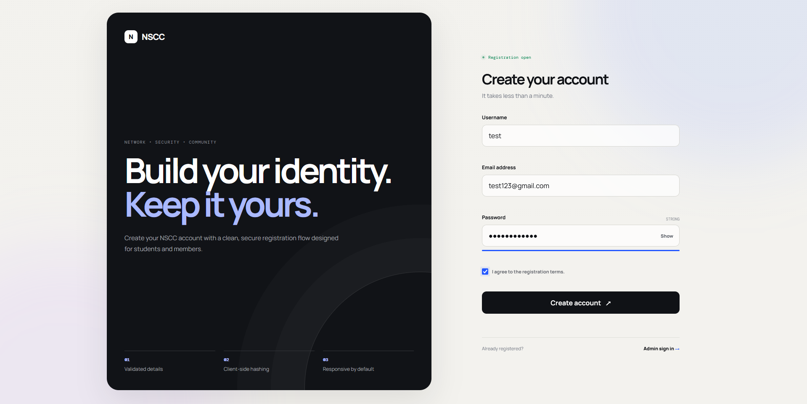
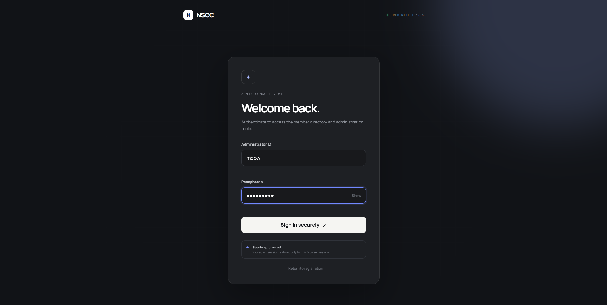
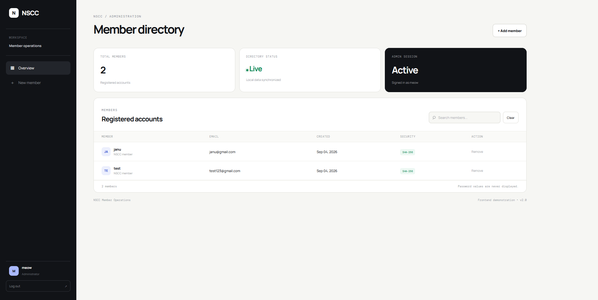

# NSCC Technical Domain — Task 1
## Signup Form with Validation and Dashboard

A polished, responsive signup and administration web application developed for the **NSCC Technical Domain Recruitment Task 1**.

The project implements the required signup flow, client-side validation, password hashing, browser-based persistence, and an administrator dashboard for managing registered accounts.

---

## 📌 Task Objective

> **Build a small web application for user signup, validation, and dashboard view.**

The application was designed to satisfy the complete Task 1 specification while adding a professional UI, responsive behavior, useful UX feedback, and an administrator-only management area.

---

## ✨ Features

### Signup

- Username input with required-field validation
- Email address validation
- Supports normal personal, student, university, Outlook, Hotmail, Gmail, and other properly formatted email addresses
- Password validation
- Password strength feedback
- Password visibility toggle
- Registration terms checkbox
- Duplicate account prevention
- Loading/submission state
- Success and error feedback
- Responsive layout for desktop and mobile

### Security

- Passwords are **never stored as plain text**
- Passwords are hashed using the browser's **Web Crypto API / SHA-256**
- The dashboard never displays the original password
- Administrator access is separated from the public signup page
- Administrator authentication uses a session stored in `sessionStorage`

### Admin Dashboard

- Protected administrator dashboard
- Total registered-member count
- Live directory status
- Current administrator session information
- Registered-member directory
- Search/filter members
- Member creation flow
- Delete/remove member functionality
- Delete confirmation
- Empty-state UI
- Responsive/mobile-friendly layout
- Automatic directory refresh after changes

### UX / UI

- Clean professional visual system
- Animated page transitions and interaction states
- Responsive design
- Mobile-friendly navigation and tables
- Accessible form labels and feedback
- Focus states for keyboard users
- Reduced-motion support
- Toast notifications
- Clear empty and loading states

---

# 🧩 NSCC Task 1 Requirements

| NSCC Requirement | Implementation |
|---|---|
| Create a signup form | `index.html` contains the complete registration form |
| Username cannot be empty | Signup validation rejects empty usernames |
| Email must be in proper format | Email syntax is validated before registration |
| Password must be at least 6 characters | Password length validation is implemented |
| Hash password before storing | SHA-256 hashing is performed before persistence |
| Add Signup button | `Create account` submits the registration form |
| Validate inputs on click | Client-side validation runs before account creation |
| Store valid details in `localStorage` | Registered accounts are persisted locally in the browser |
| Display user details in a table | Admin dashboard displays username, email, creation date and security status |
| Username / Email / Password columns | Username and email are displayed; password values are intentionally never exposed |
| Brownie: Delete button | Administrator can remove registered accounts |
| Dashboard | Protected administrator dashboard provides account management |

> **Security improvement:** Although the original task asks for a Password column, displaying even a hashed password is unnecessary and poor security practice. The dashboard therefore shows a **Security** status instead of exposing password hashes.

---

# 🏗️ Project Structure

```text
NSCC/
│
├── index.html
├── admin.html
├── dashboard.html
├── README.md
│
├── css/
│   └── style.css
│
├── js/
│   ├── storage.js
│   ├── signup.js
│   ├── admin.js
│   └── dashboard.js
│
├── screenshots/
│   ├── 01-signup.png
│   ├── 02-admin-login.png
│   └── 03-admin-dashboard.png
│
└── demo/
    └── demo-video.mp4
```

---

# 🔄 How the Application Works

## 1. Public Registration

The user starts at:

```text
index.html
```

They enter:

- Username
- Email address
- Password
- Registration agreement

The form validates the information before allowing registration.

---

## 2. Validation

The registration flow checks that:

### Username

The username cannot be empty.

### Email

The email must follow a valid email-address structure.

The application does **not** restrict users to Gmail.

Examples of acceptable domains include:

```text
@gmail.com
@outlook.com
@hotmail.com
@icloud.com
@yahoo.com
.edu / university domains
student/university domains
other properly formatted domains
```

The validation checks the structure of the address rather than maintaining an artificial list of only a few providers.

> A frontend-only application cannot reliably prove that an email inbox actually exists. True mailbox verification requires sending a verification email from a backend service.

### Password

The password must satisfy the minimum length requirement and is processed before storage.

---

# 🔐 Password Handling

The application uses the browser's:

```text
Web Crypto API
```

to generate a SHA-256 digest of the password.

Conceptually:

```text
User password
      ↓
SHA-256 hashing
      ↓
Hash generated
      ↓
Hash stored in localStorage
```

The original password is not stored in the account record.

The administrator dashboard also deliberately avoids displaying password hashes.

---

# 💾 Data Storage

This Task 1 implementation is a frontend demonstration and uses:

```text
localStorage
```

for registered-account persistence.

The application maintains the registered users in the browser so that the signup page and administrator dashboard can access the same data when served from the same origin.

Example:

```text
Signup
  ↓
Validate
  ↓
Hash password
  ↓
Save account
  ↓
localStorage
  ↓
Admin Dashboard
  ↓
Read + display members
```

---

# 🛡️ Administrator Access

The public signup page does **not** expose the member directory.

Administrator access is provided through:

```text
admin.html
```

The administrator authenticates before accessing:

```text
dashboard.html
```

The administrator session is stored using:

```text
sessionStorage
```

This means the authentication state is tied to the current browser session.

### Demo administrator

```text
Username: meow
Password: ilovecats
```

These credentials are included for demonstration/submission purposes only.

---

# 📊 Administrator Dashboard

After authentication, the administrator can:

- View total members
- View registered account information
- Search members
- Add a new member
- Remove a member
- See account creation dates
- See password-security status
- Log out

The dashboard includes a dedicated empty state when there are no registered accounts.

---

# 📱 Responsive Design

The application is designed to work across:

- Desktop
- Laptop
- Tablet
- Mobile phones

Responsive CSS adjusts:

- Form layout
- Dashboard navigation
- Cards
- Tables
- Buttons
- Spacing
- Typography
- Interactive controls

The interface remains usable on smaller screens instead of simply shrinking the desktop layout.

---

# 🎬 Demo

The complete demonstration video is included in:

```text
demo/demo-video.mp4
```

The video demonstrates the application's working flow, including registration and administrator functionality.

---

# 🖼️ Screenshots

## 01 — Signup Page



The public registration interface provides a clean signup experience with validation, password feedback, terms acceptance, and responsive design.

---

## 02 — Administrator Login



The administrator portal is separated from the public registration interface and requires authentication before the directory can be accessed.

---

## 03 — Administrator Dashboard



The dashboard provides the administrator with a member directory, account statistics, search functionality, creation dates, security status, and account-removal controls.

---

# ▶️ Running the Project Locally

## Recommended method

Serve the project through a local HTTP server.

### VS Code + Live Server

Install the **Live Server** extension in VS Code.

Then right-click:

```text
index.html
```

and choose:

```text
Open with Live Server
```

The application should open on an address similar to:

```text
http://127.0.0.1:5500/
```

### Alternative

Using Node.js:

```bash
npx serve .
```

Then open the local URL provided by the server.

### Important

Do **not** test the project by opening individual files directly as:

```text
file:///.../index.html
```

Use a local HTTP server so all pages operate under the same origin and share the same `localStorage`.

---

# 🚀 Deployment

**Deployment URL:** `ADD-YOUR-LIVE-LINK-HERE`

Replace the value above with the actual deployed URL before submitting the task.

For example:

```text
https://your-project.pages.dev
```

or:

```text
https://yourusername.github.io/your-repository/
```

The final deployed URL should also be placed in the **Task 1 folder's README**, as required by the NSCC submission guidelines.

---

# 🧪 Tested User Flow

The main application flow is:

```text
Public Signup
     ↓
Enter details
     ↓
Validate username
     ↓
Validate email
     ↓
Validate password
     ↓
Accept registration terms
     ↓
Hash password
     ↓
Store account
     ↓
Success notification
     ↓
Administrator Login
     ↓
Authenticated Session
     ↓
Member Dashboard
     ↓
Search / Add / Remove Members
```

---

# 🏆 Brownie Points / Additional Improvements

Beyond the minimum specification, this implementation includes:

- Administrator authentication
- Protected dashboard
- Password hashing
- Password visibility control
- Password strength feedback
- Duplicate-account prevention
- Search functionality
- Delete confirmation
- Toast notifications
- Loading states
- Empty states
- Account creation timestamps
- Responsive mobile interface
- Accessibility-focused form controls
- Reduced-motion support
- Shared storage abstraction
- Safe DOM rendering
- No password values displayed in the administration interface
- Professional dashboard UI
- Clear separation between public and administrative areas

---

# ⚠️ Technical / Security Note

This project is intentionally implemented as a **frontend-only technical task**.

`localStorage`, `sessionStorage`, and client-side JavaScript are suitable for demonstrating the requested functionality, but they are **not equivalent to production authentication or a server-side database**.

For a production system, the architecture should use:

```text
Frontend
   ↓
Secure API
   ↓
Server-side authentication
   ↓
Database
```

with server-side password hashing using a password-specific algorithm such as Argon2id or bcrypt, proper authorization, secure cookies/session handling, HTTPS, rate limiting, CSRF protection where applicable, and email verification.

The current implementation should therefore be considered a **Task 1 frontend demonstration**, not a production authentication system.

---

# 🛠️ Technologies Used

- HTML5
- CSS3
- Vanilla JavaScript
- Web Crypto API
- DOM APIs
- `localStorage`
- `sessionStorage`
- CSS media queries
- Responsive web design

No frontend framework is required.

---

# 📋 Submission Checklist

Before submitting to NSCC:

- [ ] Repository is **Public**
- [ ] Task 1 is clearly separated/named
- [ ] `README.md` is present inside the Task 1 folder
- [ ] Deployment link is updated
- [ ] Screenshots are included
- [ ] Demo video is included
- [ ] Signup flow works
- [ ] Validation works
- [ ] Password hashing works
- [ ] Accounts persist correctly
- [ ] Admin login works
- [ ] Dashboard displays registered members
- [ ] Search works
- [ ] Delete works
- [ ] Mobile layout has been checked
- [ ] Commit history contains meaningful commit messages

---

## 👨‍💻 Project

**NSCC Technical Domain — Recruitment Task 1**

**Project:** Signup Form with Validation and Dashboard

**Stack:** HTML5 · CSS3 · Vanilla JavaScript

**Status:** Complete
